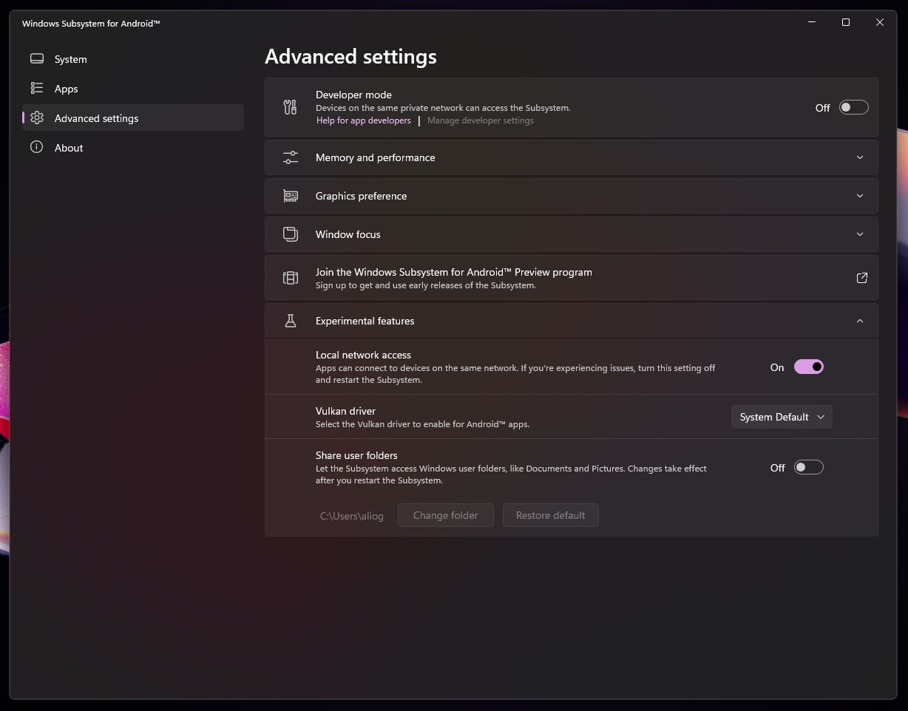
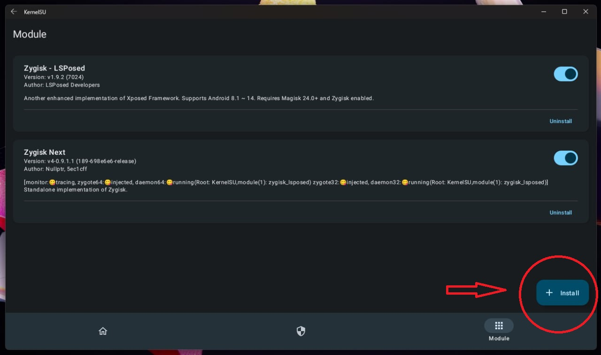
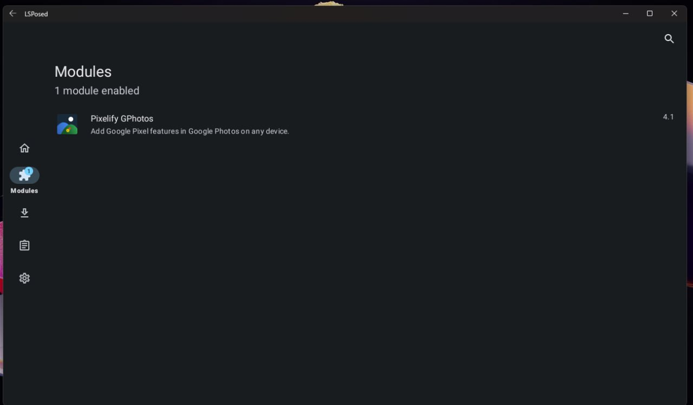
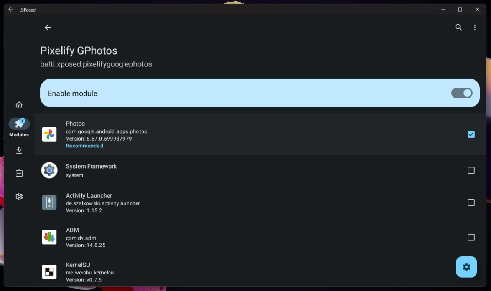
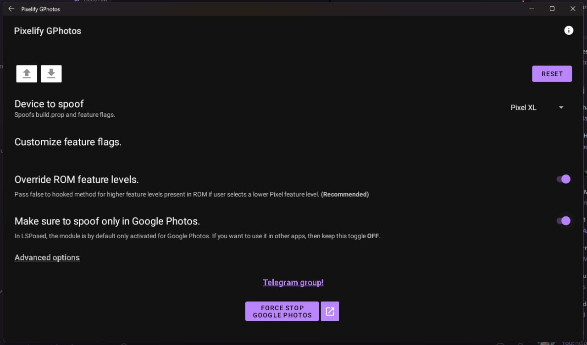
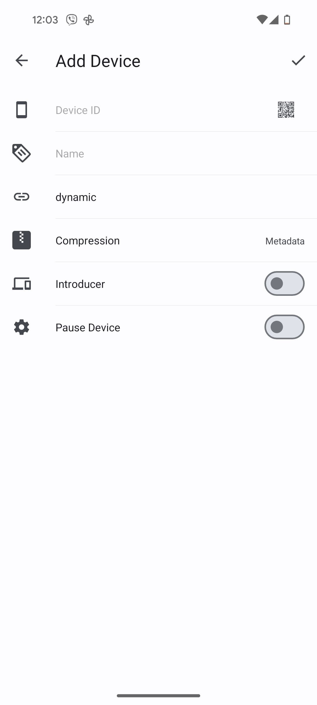
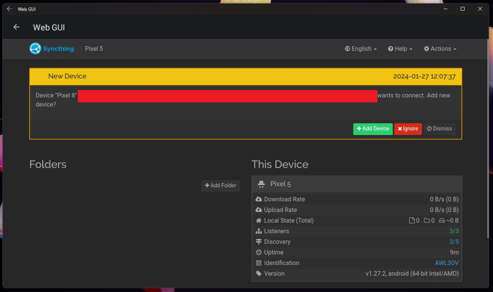
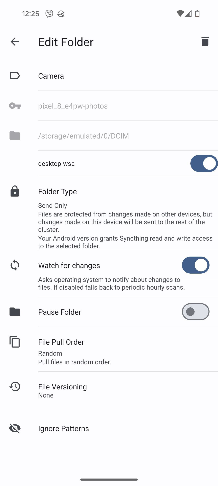

# Unlimited Google Photos storage with Windows 10/11

## [Requirements](https://github.com/MustardChef/WSABuilds?tab=readme-ov-file#requirements)

## Step 0
**If you have previously installed WSA, uninstall it**

Follow the [instructions](https://github.com/MustardChef/WSABuilds?tab=readme-ov-file#--installation) on installing WSA with KernelSU. When downloading from the releases, choose the file named `WSA_XXXX.X0000.X.0_XXXX_Release-Nightly-kernelsu-vX.X.X-MindTheGapps-XX.X-RemovedAmazon.7z`.

## Step 1
Make sure to enable the Local network access in the Windows Subsystem for Android app

## Step 2
After you have WSA installed on your pc, you can use the start menu to start apps. It's best to open up the Play Store/ and install the following tools for ease of use
- a Download manager - [ADM](https://play.google.com/store/apps/details?id=com.dv.adm&hl=en&gl=US) or [Navi](https://github.com/TachibanaGeneralLaboratories/download-navi)
- a File manager - [Material Files](https://github.com/zhanghai/MaterialFiles)
- a Launcher - [Activity Launcher](https://play.google.com/store/apps/details?id=de.szalkowski.activitylauncher&hl=en&gl=US) or [Lawnchair](https://github.com/LawnchairLauncher/lawnchair)

After that, use the download manager to download [the KernelSU manager](https://github.com/tiann/KernelSU/releases/download/v0.7.6/KernelSU_v0.7.6_11458-release.apk) if it's not already installed, either use the hyperlink or you can find it on kernelsu's github releases (always the last file). You can use your file manager to install the apk.

## Step 3
We will have to install the [Zygisk Next](https://github.com/Dr-TSNG/ZygiskNext/releases/download/v4-0.9.1.1/Zygisk-Next-v4-0.9.1.1-189-release.zip) module inside of the KernelSU manager. First download it through your download manager of choice, then open the KernelSU app, go to the modules tab, press the install button, and navigate to the Zygink Next zip you downloaded.

>Note that when you first open the app you won't have any modules installed

After installing, press the reboot button on the bottom right.

## Step 4
In this step we will install LSposed, so that we can use Pixelify GPhotos. The procedure is the same as the previous step. Download the [LSposed module](https://github.com/LSPosed/LSPosed/releases/download/v1.9.2/LSPosed-v1.9.2-7024-zygisk-release.zip), open the KernelSU app, click the install button, find the LSposed zip, click on it and after it's installed, press the reboot button.

## Step 5
Open the Play Store and download [the LSposed app](https://play.google.com/store/apps/details?id=org.lsposed.manager&hl=en&gl=US). Download the [Pixelify Google Photos apk](https://github.com/BaltiApps/Pixelify-Google-Photos/releases/download/v4.1/pixelify_gphotos_v4.1.apk) and install it through the File explorer. Go back to the LSposed app and enable the module. Reboot again

## Step 6
Open the Pixelify app. Make sure to select Pixel XL as the Device to Spoof. Press "Force Stop Google Photos"

Great! Now folders selected for backup in Google Photos will backup for free in their original quality! But you don't have any folders to backup...

## Step 7
We need to figure out how to transfer photos to the WSA file system. This method i'll show you moves photos automatically and over the network, but can be rather buggy sometimes.

Open the Play Store on your PC and install [Syncthing](https://play.google.com/store/apps/details?id=com.nutomic.syncthingandroid&hl=en&gl=US). Go through the setup and allow all the permissions it requires. Also allow background usage. You will be at the folders view. There will be a folder there that we don't need. Press it and delete it with the button in the top right.

Next open the hamburger menu on the top right and press the "Show device ID" button.

Install Syncthing on your phone (i don't have an iPhone to test this solution with). Go to the Devices page. Press the + button in the top right. Press the QR code button next to the Device ID field and scan the qr code from your PC. Set a name for your device and you're done, press the check in the top right. 

You should recieve a notification on your PC to add your phone as a device, but for me it was quite unreliable. You can open the Web GUI from the hamburger menu. There you'll have a big yellow alert to add you phone. Press the Add Device button. A new window will pop up. Press the Sharing tab and press the Auto Accept check.

Now go to your phone. In the folders view, your camera folder should already be added. If you want to add a different folder, press the plus button at the top right. Now press the folder you want to share. Set the folder type as Send Only, set Watch for changes on. Above folder type there should be a toggle for your added devices, toggle it on.

After a few seconds a folder should appear in your Folders view on your PC's Syncthing app. It should automatically start syncing the photos from your phone to the PC.

After the syncing is done, your photos may not initially appear in the Google Photos app. I manage to fix this by opening the file manager and going the the folder with the photos. Just opening it seems to refresh the file system and the appear in gphotos. After that just go to the On device folder in Google Photos, open the folder and enable Backup. Voila!

 